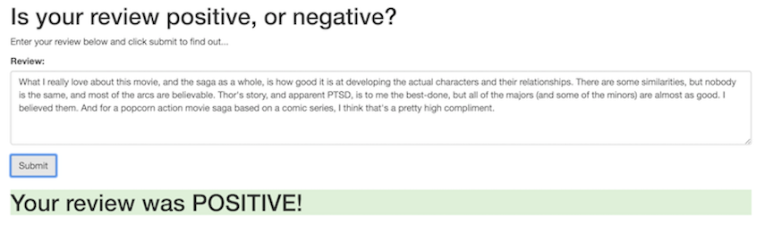

# Deploying a Sentiment Analysis Model on SageMaker Project

This project uses Amazon SageMaker to deploy a recurrent neural network machine learning model onto AWS which predicts the sentiment of a movie review. The prediction model is implemented using Pytorch framework and trainned on IMDB dataset.  

It also has a simple web page which a user can use to enter a movie review. The web page will then send the review off to our deployed model, provides the predicted sentiment whether the review  is Positive or Negative.

 Here's a screenshot for the web page.





### Instructions to execute the notebook

Clone this repository:

```
git clone https://github.com/xu4/sagemaker-sentiment-analysis-model
```

Open the SageMaker Project.ipynb

```
jupyter notebook SageMaker Project.ipynb
```


### General Outline of the notebook
* Step 1: Downloading the data
* Step 2: Preparing and Processing the data
* Step 3: Upload the data to S3
* Step 4: Build and Train the PyTorch Model
* Step 5: Testing the Model
* Step 6: Deploying the model for testing
* Step 7: Use the model for testing
* Step 6 Deploy the model for the web app
* Step 7 Use the model for the web app


### Report
An HTML export of the project notebook. [Report.html](report.html) 
